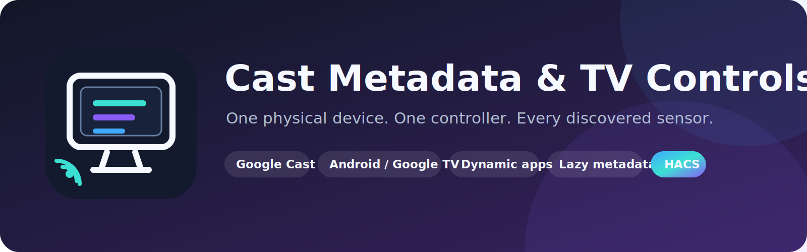

<p align="center">
  
</p>

# Cast Metadata & TV Controls

A fully local Home Assistant integration that combines Google Cast, Android TV Remote, Android TV ADB, and manufacturer TV integrations into **one organized controller device per physical device**.

## Version 7.2 architecture

- One integration entry under **Settings → Devices & services → Integrations**.
- One integration-owned device for each independent physical TV, Chromecast, Cast speaker, or smart display.
- One compact `media_player` controller per physical device.
- Every discovered metadata sensor belongs to that same device.
- New sensors are created automatically after new non-null attributes first appear.
- Completely new independent devices are hot-added without interrupting existing controllers.
- Persistent physical identities survive native entity recreation.
- App management, activities, command timing, capability routing, and Wake-on-LAN are configured in the integration UI.
- No generated button, select, number, or switch entity swarm.

## Persistent physical-device identity

Version 7.2 stores a durable local identity profile for each physical device. It combines stable evidence such as network connections, MAC addresses, normalized name and area, platform identity, and Home Assistant device-registry information.

This lets a controller reconnect to the same integration-owned device when a native Cast, Android TV, ADB, or manufacturer entity is removed and recreated. Learned applications and metadata sensor registrations remain local.

## Physical-device grouping

Automatic grouping uses conservative evidence from Home Assistant:

1. Shared device-registry IDs.
2. Shared network connections such as MAC addresses.
3. Matching non-generic names, with area checks.
4. Source type and capability priority.

A physical TV can combine:

```text
Android TV Remote
Android TV ADB
Google Cast
TV manufacturer media player
AV receiver media player
```

Standalone Chromecast dongles, Cast speakers, and smart displays remain separate devices.

### Explicit grouping

When integrations expose unrelated names or identifiers:

1. Open **Settings → Devices & services**.
2. Open **Cast Metadata & TV Controls**.
3. Select **Configure**.
4. Choose **Combine source entities**.
5. Select every native `media_player` entity representing the same physical setup.

## Capability routing

Automatic routing remains the recommended default. For unusual installations, each capability can be forced through the most reliable native entity.

Open:

**Settings → Devices & services → Cast Metadata & TV Controls → Configure → Route controller capabilities**

Configurable categories:

```text
Power
Volume and mute
Playback
Seeking
Media metadata
Native TV applications
Cast applications
Physical inputs
Remote navigation
Restart
```

Example:

```text
Power: Samsung TV
Volume: AV Receiver
Playback: Google Cast
Metadata: Google Cast
Native apps: Android TV Remote
Inputs: Sony Bravia
Navigation: Android TV Remote
Restart: Android TV ADB
```

A route that points to a removed entity produces a Home Assistant Repairs warning instead of silently failing.

## Application discovery and management

The application catalogue combines:

- Common Android/Google TV applications
- Apps configured in Android TV Remote
- Apps learned when active
- Android TV ADB source entries
- Manually registered applications

Transient pseudo-apps such as **Ready to Cast** are filtered.

### Manage applications

Open:

**Settings → Devices & services → Cast Metadata & TV Controls → Configure → Manage applications**

For every physical device you can:

- Rename an application
- Hide it from the source selector
- Mark it as a favourite
- Set its display order
- Restore automatic behaviour by clearing its custom values

The controller publishes `favorite_sources` and `managed_apps`, allowing dashboard cards to update automatically without helpers.

### Register a missing TV app

```yaml
action: cast_attribute_sensors.register_tv_app
data:
  entity_id: media_player.living_room_tv_controller
  app_id: com.example.androidtv
  app_name: Example TV App
```

## Activities

Activities are helper-free presets stored inside the integration. An activity can:

- Power on the physical device
- Select a native app, Cast app, or physical input
- Set volume
- Set mute state

Create them under:

**Configure → Add or replace an activity**

Run an activity from an automation or dashboard:

```yaml
action: cast_attribute_sensors.run_activity
data:
  entity_id: media_player.living_room_tv_controller
  activity: Movie Night
```

The controller publishes `activity_names` so compatible cards can create a dynamic activity selector.

## Command timing

Some televisions need additional time after power-on, leaving Cast, or launching an application. Configure device-specific delays under:

**Configure → Configure command timing**

Available delays:

- After power-on
- After leaving Cast
- Application confirmation
- Application retry
- Power-cycle restart

The defaults are optimized for responsive Android/Google TV devices. Increase them only when a specific TV needs more time.

## Wake-on-LAN

Wake-on-LAN is an optional fallback when no native integration exposes `turn_on`.

Open:

**Configure → Configure Wake-on-LAN**

The integration proposes a detected MAC address when available and allows the broadcast address and port to be changed. Native power-on always takes priority over Wake-on-LAN.

## Controller health and Repairs

Every physical device receives a diagnostic `Controller problem` binary sensor. Its attributes report:

- Persistent physical-device ID
- Native source entities and platforms
- Available and unavailable sources
- Configured capability routes
- Stale routes
- Managed application count
- Activity count
- Wake-on-LAN status
- Overall health: `healthy`, `degraded`, or `unavailable`

Home Assistant Repairs reports:

- Missing members from an explicit physical-device group
- Capability routes whose native source entity no longer exists

## Transition events

Each physical device receives a diagnostic **Transitions** event entity. It emits normalized events suitable for automations:

```text
power_changed
application_changed
input_changed
playback_changed
volume_changed
mute_changed
```

Event data includes the old value, new value, source entity, and persistent physical-device ID.

## Controller capabilities

The controller exposes features supported by at least one underlying entity:

- Power on and off
- Play, pause, stop, previous, and next
- Volume, mute, and volume stepping
- Shuffle and repeat
- Corrected absolute and relative seeking
- Android/Google TV application launching
- Cast receiver application launching
- HDMI, tuner, console, AV receiver, and manufacturer inputs
- Current app, title, artist, album, artwork, duration, and position

The source selector separates mechanisms clearly:

```text
TV App · YouTube
TV App · Netflix
Cast · YouTube
Input · HDMI 1
Input · PlayStation 5
```

When switching from Cast to a native app or input, the integration leaves the active receiver session, returns to TV Home when available, launches the target, and retries one failed native-app launch.

## Dynamic metadata sensors

Every underlying source is watched continuously. A sensor is created after its value first appears, remains registered, and becomes `unknown` when the source temporarily stops reporting it.

Examples:

```text
sensor.living_room_tv_cast_media_title
sensor.living_room_tv_cast_media_artist
sensor.living_room_tv_cast_app_id
sensor.living_room_tv_android_tv_remote_app_name
sensor.living_room_tv_manufacturer_source
```

Structured and long values are retained through attributes. Complete source snapshots are available as disabled-by-default diagnostic sensors.

## Unified TV Card

The companion HACS dashboard repository provides a responsive controller card:

[**Togarriapa/HomeAssistant-Unified-TV-Card**](https://github.com/Togarriapa/HomeAssistant-Unified-TV-Card)

It includes:

- Dynamic application dropdown
- Separate physical-input dropdown
- Mute directly beside the volume slider
- Power and restart
- Playback and corrected relative seeking
- Android/Google TV directional remote
- Artwork, current media, application, and source
- Managed favourites, activities, and optional diagnostics

Example:

```yaml
type: custom:unified-tv-card
entity: media_player.living_room_tv_controller
show_artwork: true
show_remote: true
seek_seconds: 10
```

## Useful actions

### Seek relative to the corrected live position

```yaml
action: cast_attribute_sensors.seek_relative
data:
  entity_id: media_player.living_room_tv_controller
  seconds: 10
```

Use a negative value to rewind.

### Send a remote command

```yaml
action: cast_attribute_sensors.send_command
data:
  entity_id: media_player.living_room_tv_controller
  command: HOME
```

### Restart the physical device

```yaml
action: cast_attribute_sensors.restart_device
data:
  entity_id: media_player.living_room_tv_controller
```

### Run an activity

```yaml
action: cast_attribute_sensors.run_activity
data:
  entity_id: media_player.living_room_tv_controller
  activity: Gaming
```

Other actions:

- `cast_attribute_sensors.launch_cast_app`
- `cast_attribute_sensors.launch_tv_app`
- `cast_attribute_sensors.register_tv_app`
- `cast_attribute_sensors.send_command`
- `cast_attribute_sensors.seek_relative`
- `cast_attribute_sensors.restart_device`
- `cast_attribute_sensors.run_activity`

## Automatic discovery of new devices

When a new supported TV or Cast `media_player` is added to Home Assistant:

1. The source manager detects it.
2. Physical identity and grouping are calculated.
3. A completely new independent controller, health sensor, transition event, and metadata listeners are hot-added.
4. Existing controllers remain available.

A controlled integration reload occurs only when a new source must be attached to an existing physical device or an existing membership changes, because Home Assistant must then move registered entities between devices.

## Installation with HACS

1. Open **HACS → Integrations**.
2. Open the three-dot menu and choose **Custom repositories**.
3. Add:

   ```text
   https://github.com/Togarriapa/HomeAssistant-Cast-Metadata-Controls
   ```

4. Select **Integration**.
5. Install and restart Home Assistant.
6. Open **Settings → Devices & services → Add integration**.
7. Add **Cast Metadata & TV Controls**.

No YAML configuration is required.

## Upgrading to 7.2

Version 7.2 performs a one-time generated-entity migration:

- Rebuilds controller, health, and transition event entities
- Preserves learned applications
- Preserves persistent physical identities
- Preserves metadata sensor unique IDs and registrations
- Preserves existing groups and capability routes
- Removes obsolete empty virtual devices after setup

After updating through HACS, restart Home Assistant and allow approximately ten seconds for device-registry cleanup.

## Recorder considerations

```yaml
recorder:
  exclude:
    entity_globs:
      - sensor.*_attributes
```

## Scope and privacy

The integration uses only information and actions already exposed by Home Assistant’s native integrations. It adds no independent cloud account, external API, telemetry, or polling loop.

## License

MIT License.
